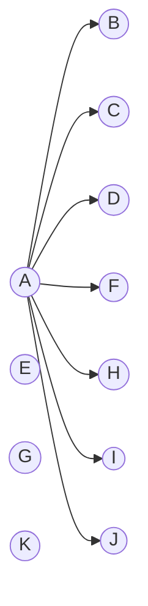

# Docker
```
docker run -it -dp 9000:9000 -w /app -v "${PWD}:/app" 工作项目镜像 sh -c "node"
```
# IF 
这是一个webpack5 + react + typescript脚手架

# File
```
src
├─Api
├─Components
│    ├─Home
│    │  ├─assets
│    │  │  ├─components
│    │  │  ├─img
│    │  │  └─test
│    │  ├─index.tsx
│    │  ├─index.less
│    │  └─hooks.ts
│    └─other....
├─Layer
│  ├─index.tsx
│  └─index.less
├─Pages
│    ├─Home
│    │  ├─assets
│    │  │  ├─components
│    │  │  ├─img
│    │  │  └─test
│    │  ├─index.tsx
│    │  ├─index.less
│    │  └─hooks.ts
│    └─other....
├─Theme
└─Toolbox
    ├─debugger.tsx
    ├─goDB.less
    ├─index.ts
    └─other....
```


